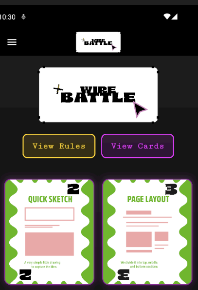
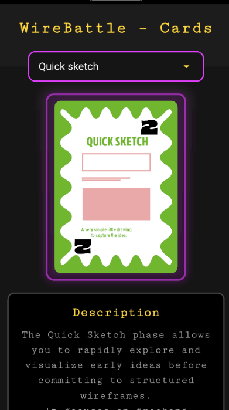
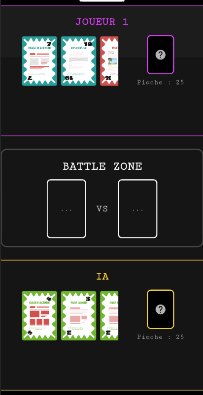

# 🎮 WireBattle — Jeu de cartes basé sur le wireframing UX


WireBattle est un jeu de cartes stratégique développé en **Flutter**, inspiré du jeu de la “Bataille”, mais réinventé autour des étapes du **wireframing UX/UI**.

A la base un jeu de carte sur table créer lors du projet English Game

Chaque carte représente une étape du design (Quick Sketch, Page Layout, Mockup…), accompagnée de **Power‑ups** et d’un **Joker** qui peuvent renverser le cours de la partie.

--- 

## 📚 Table des matières

- [✨ Fonctionnalités principales](#-fonctionnalités-principales)
- [🗄️ Stockage des données](#️-stockage-des-données--plus-dapi-maintenant-une-base-de-données-locale)
- [📁 Structure du projet](#-structure-du-projet)
- [🖼️ Captures d’écran](#️-captures-décran)
- [🛠️ Installation](#-installation)
- [👤 Auteur](#-auteur)

---

## ✨ Fonctionnalités principales

### 🃏 Système de cartes
- 13 cartes de base représentant les étapes du wireframing  
- 4 Power‑ups avec effets uniques  
- 1 Joker qui gagne automatiquement le pli et donne un Power‑up  
- Duplication automatique des cartes pour équilibrer les decks

### ⚔️ Gameplay
- Chaque joueur commence avec :
  - 3 cartes en main  
  - 25 cartes dans sa pioche  
- Règles de bataille classiques :
  - Carte cachée  
  - Carte révélée  
  - Résolution en chaîne  
- Effets des Power‑ups :
  - **Power_up1** → voler une carte dans la pioche adverse  
  - **Power_up2** → échanger les deux pioches  
  - **Power_up3** → doubler la valeur de la carte jouée  
  - **Power_up4** → jouer deux cartes et additionner leurs valeurs  

### 🤖 Intelligence Artificielle
- IA simple mais efficace  
- Utilise ses Power‑ups  
- Joue automatiquement ses cartes  
- Compatible avec toutes les mécaniques du jeu

### 🎨 Interface & animations
- Thème futuriste sombre  
- Cartes en SVG  
- Animation d’activation des Power‑ups  
- Zones de bataille claires et lisibles  
- Transitions fluides

---

## 🗄️ Stockage des données — **Plus d’API, maintenant une base de données locale**

Au départ, le jeu utilisait une API distante pour charger les cartes.  
Ce n’est **plus le cas**.

### ✔️ WireBattle utilise désormais **SQLite** pour stocker :
- L’historique des matchs  
- Les scores du joueur  
- Les statistiques  
- Les données persistantes du jeu  

### Pourquoi SQLite ?
- Fonctionne hors‑ligne  
- Très rapide  
- Aucun serveur externe requis  
- Parfait pour les jeux mobiles

---

## 📁 Structure du projet
```
lib/
├── controllers/              # Logique de jeu
│    └── game_controller.dart
│
├── models/                   # Modèles de données
│    ├── card_model.dart
│    ├── player.dart
│    └── user.dart
│
├── repositories/             # Accès aux données (SQLite)
│    ├── match_repository.dart
│    └── user_repository.dart
│
├── screens/                  # Écrans de l'application
│    ├── accueil.dart
│    ├── cards.dart
│    ├── gameboard.dart
│    ├── profile.dart
│    ├── rules.dart
│    └── scoreboard.dart
│
├── services/                 # Services métier
│    ├── game_engine.dart
│    └── database_service.dart
│
├── states/                   # Providers (state management)
│    ├── menu_provider.dart
│    ├── user_provider.dart
│    └── match_provider.dart
│
├── widgets/                  # Composants réutilisables
│    ├── drawer.dart
│    └── card_widget.dart
│
└── main.dart                 # Point d'entrée de l'application
```

---

## 🖼️ Captures d’écran

### 🏠 Écran d’accueil


### 🎴 Vue des cartes


### ⚔️ Plateau de jeu


---

## 🛠️ Installation

```bash
git clone https://github.com/Zenith2956/WireBattle.git
cd WireBattle
flutter pub get
flutter run

---

## 👤 Auteur

**Arthur Callens**  
Développeur du projet WireBattle  
Rennes, France  
